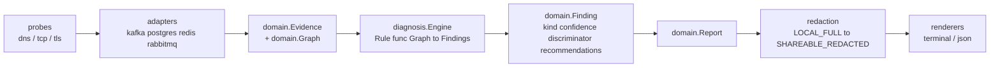
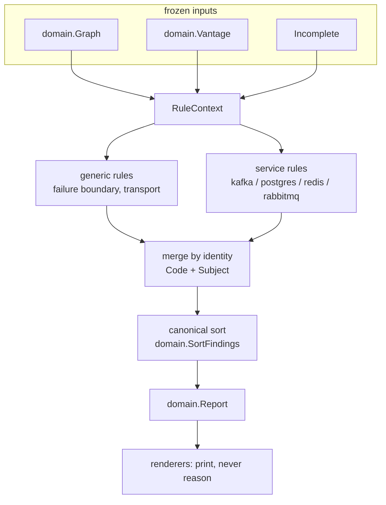
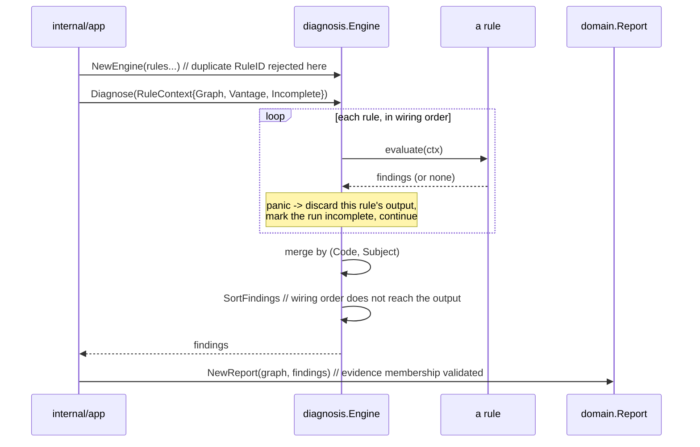
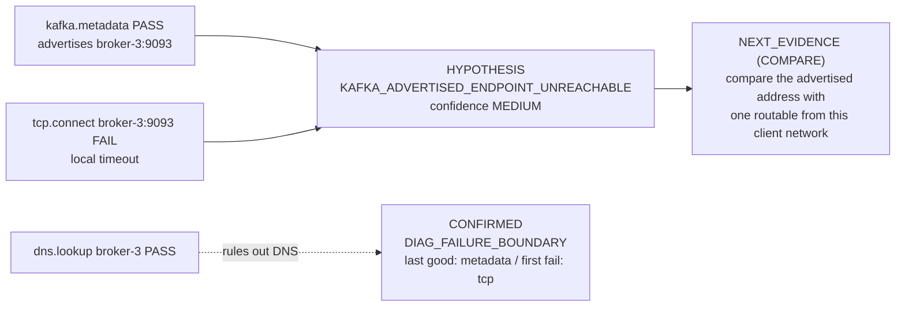
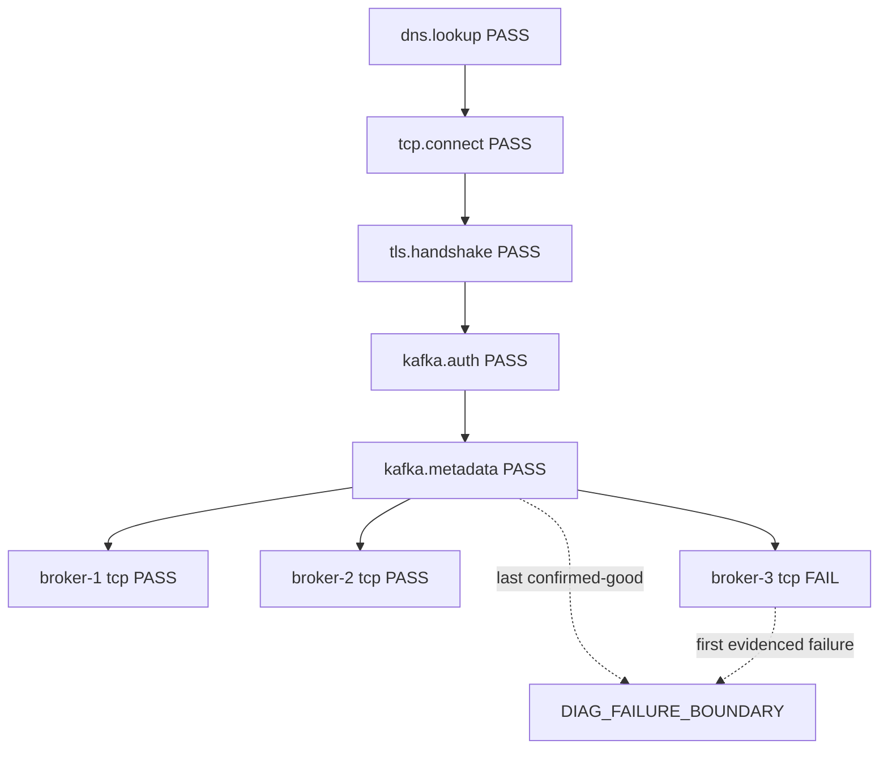
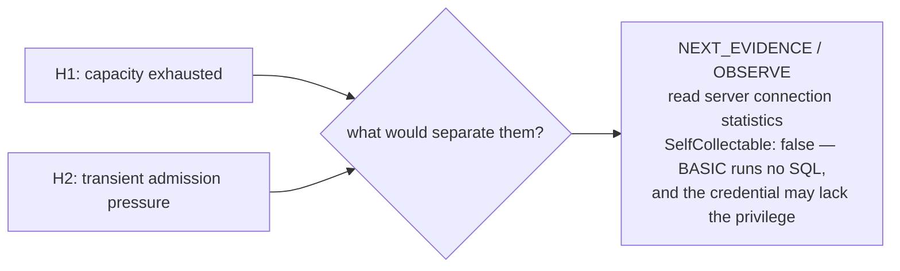
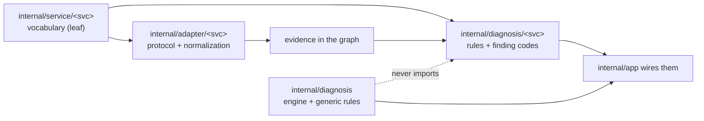
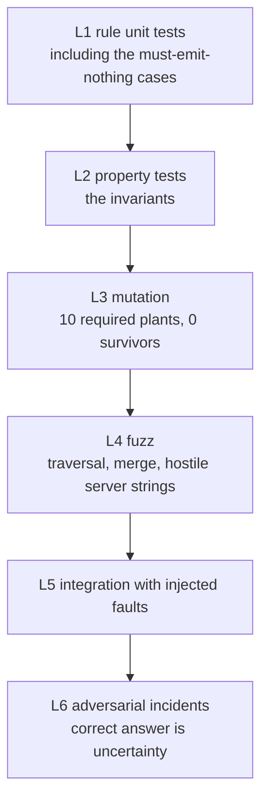

# Diagnostic Intelligence — Phase 10 architecture

**Status:** frozen by ADRs 0078–0083. **No implementation exists.**

This document is the coherent account of what those six records decide together, and the place
where the exemplars, the fault matrix, the adversarial review and the roadmap live. Where it
disagrees with an ADR, the ADR wins.

---

## A. What exists today

svcdoctor v0.4.0 already has more of the reasoning model than a reader would expect, which is
why Phase 10 is mostly *behaviour* rather than *structure*.

| Layer | Package | Owns | Must not |
|---|---|---|---|
| collection | `internal/probe/*` | DNS, TCP, TLS facts | know any service |
| protocol | `internal/adapter/<svc>{,/wire}` | protocol semantics, normalization | re-implement transport; leak raw objects |
| vocabulary | `internal/service/<svc>` | steps, attribute keys — a leaf | conclude, collect, hold a secret |
| reasoning | `internal/diagnosis{,/<svc>,/transport}` | rules over a frozen graph | perform I/O, read a secret, import a probe/adapter/renderer |
| model | `internal/domain` | evidence, graph, finding, report, states | diagnose, redact, render |
| redaction | `internal/security/redaction` | `LOCAL_FULL` → `SHAREABLE_REDACTED` | diagnose, mutate |
| presentation | `internal/render/*` | explaining a finished report | reason, recompute, hide |
| composition | `internal/app`, `internal/cli` | wiring, budgets, exit codes | contain service branches |
| fleet | `internal/fleet/*` | multi-target scheduling and aggregation | name a service; correlate targets |

**Already present in `SchemaVersion` 1:** `kind` (`CONFIRMED`/`HYPOTHESIS`), ordinal
`confidence`, `discriminator` ("the observation that would settle it, never a remediation"),
`evidenceRefs` with membership validation, `recommendations[]` as an **object**,
`vantageDependent`, `subject`, `layer`. Plus `Graph.BlockedBy`, five states, 42 failure classes,
and `docs/FINDINGS.md`'s 18-rule quality bar.

**Enforced by the build, not by convention:** `.golangci.yml`'s `diagnosis-is-pure` denies
`internal/probe`, `internal/adapter`, `internal/render`, `internal/platform`,
`internal/security`, `net`, `net/http`, `crypto/tls` and `os` to every package under
`internal/diagnosis/`.

### The gaps Phase 10 closes

1. No failure boundary — the report says what failed, not *where failing began*.
2. No convergence handling — two rules reaching one conclusion produce two findings (ADR 0017
   deferred this deliberately, for want of an identity definition).
3. Confidence is defined by adjective, not by an admission test.
4. Contradicting, missing and blocked evidence are distinguished in prose, not in policy.
5. Recommendations are unclassified strings, so nothing prevents an unsafe one.
6. Rules cannot see whether svcdoctor's own budget cut the run short.

---

## B. Proposed architecture

Everything left of `RuleContext` is frozen before a rule runs. Everything right of it is pure.
The engine gains exactly two responsibilities beyond ADR 0017: **merge** and **fail-closed
recovery**. It gains no knowledge of any service.

---

## C. Rule evaluation flow

A rule is a pure function. It cannot dial, read a file, read the environment, obtain a
credential or read the clock — the first five are build failures today and the sixth becomes one
in 10.1.

---

## D. Evidence → hypothesis traceability

Every claim resolves to nodes in the same report's graph; ADR 0014 validates it at assembly.

The contrast is the proof: the advertisement and the transport failure are *both* cited, because
either alone establishes nothing (`docs/FINDINGS.md` §3.1 rule 10).

---

## E. Competing hypotheses

One graph, two explanations, neither provable:

| | H1 | H2 |
|---|---|---|
| claim | the endpoint is not reachable from this vantage point | the broker advertised an address unsuitable for this client network |
| supported by | the transport failure on that address | the advertisement plus the transport failure |
| confidence | `MEDIUM` | `MEDIUM` |
| discriminator | is the address routable from here at all? | does the advertised address differ from one that is? |

Both are emitted. Neither is ranked above the other, no "most likely" flag exists, and mutual
exclusivity is not represented — the operational value is the discriminator, and each carries
its own (ADR 0081 §2.5). The renderer shows both; picking one would be reasoning.

---

## F. Failure boundary

Per **subject**, never per run. `SKIPPED` and `UNKNOWN` are neither half. The boundary states
where observation stopped succeeding and nothing about why — the "why" is a hypothesis.

**What it rules out** is rendered from the graph the boundary points into: DNS, TCP, TLS, auth
and metadata are `PASS`, so a renderer may say so. It may not say "therefore the cause is X".
No `RULED_OUT` finding is created (ADR 0079 §2.4).

---

## G. Next-best-evidence

A next-evidence recommendation states what to observe, why it discriminates, whether svcdoctor
could collect it, and its safety class — which is always `OBSERVE`, `VERIFY` or `COMPARE`.
`SelfCollectable: false` is frequently the honest answer and is more useful than implying
svcdoctor already looked. Nothing is collected automatically, in this phase or by this design.

---

## H. Service extension model

The generic engine knows: endpoint, subject, layer, step, state, failure class, dependency,
blocked-by, discovery, sibling set, boundary, confidence, evidence reference.

It does not know: `advertised.listeners`, `pg_is_in_recovery()`, SQLSTATE, AMQP vhosts, RESP
verbs, SASL mechanism names, or any service's finding codes. A `go/ast` guard enforces it.

**Adding a service touches no generic file.** If it must, the generic vocabulary is missing a
concept and that is an ADR.

---

## I. Service exemplars

### Kafka

| Scenario | Boundary | May claim | May not claim | Ceiling |
|---|---|---|---|---|
| **A** bootstrap and metadata pass; discovered `broker-3` TCP fails | branch-specific, at TCP on `broker-3` | that endpoint unreachable from here; advertised-address hypothesis | "the broker is down"; "a firewall blocks it" | `MEDIUM` |
| **B** metadata advertises `127.0.0.1` | same shape | that the advertised address is loopback **and** unreachable from this vantage | that loopback is wrong — it is legitimate when client and broker share a host | `MEDIUM` |
| **C** one broker of three unreachable | branch-specific; siblings divergent | a per-endpoint claim, with the sibling counts | "the cluster is degraded" — that is a cluster-health verdict svcdoctor does not measure | `MEDIUM` |
| **D** DNS and TCP pass; TLS hostname verification fails | linear, at TLS | identity mismatch, naming what was presented versus expected | "the certificate is invalid" — it may be valid for another name | `HIGH` (direct: the handshake said so) |

**B is the trap.** `127.0.0.1` is not evidence of misconfiguration; the *combination* of a
loopback advertisement and a failed connection from this vantage is evidence that this client
cannot use it. Sibling comparison (C) changes confidence without the generic core knowing what
a broker is: it counts subjects reached from one parent by one step.

### PostgreSQL

| Scenario | May claim | May not claim | Ceiling |
|---|---|---|---|
| **A** TCP and TLS pass; server rejects authentication | transport works; TLS negotiated; the server rejected the credential | any network remediation; "the password is wrong" when the server said the role or database was the problem | `HIGH` (SQLSTATE) |
| **B** SQLSTATE `53300` | the server rejected the connection at its resource limit | "a connection leak"; "the pool is misconfigured"; "raise `max_connections`" | `HIGH` for the rejection; **no cause hypothesis at all** |
| **C** multi-host: A primary, B standby | the observed roles | that either is wrong — no expectation was declared | n/a |
| **D** a write-capable endpoint behaves read-only | the observed role | "the wrong host" until an `expect:` block exists (ADR 0083 §2.6) | n/a |

**B is the flagship refusal.** The rejection is `HIGH` by direct authority; every candidate
*cause* is indistinguishable from the others with what svcdoctor can see, so it emits none and
offers a next observation instead.

### Redis / Valkey

| Scenario | May claim | May not claim |
|---|---|---|
| **A** TCP and RESP pass; `AUTH` fails | the server rejected authentication | that the credential is wrong when the server said the *user* is unknown |
| **B** the endpoint identifies as Valkey | the observed implementation | that this is a problem |
| **C** auth succeeds, a command is denied | **authorization**, not authentication — a distinct claim at a distinct layer | "the credential is invalid" |
| **D** an expected capability is absent | the observed capability set | a fault, absent a declared expectation |

### RabbitMQ / LavinMQ

| Scenario | May claim | May not claim |
|---|---|---|
| **A** TCP, TLS and AMQP negotiation pass; vhost access refused | authorization refused for the named vhost | "the vhost does not exist" unless the peer said so |
| **B** the endpoint accepts TCP but does not speak AMQP definitively | protocol identity **UNKNOWN**, boundary at protocol | "not an AMQP server" |
| **C** a timeout leaves protocol identity unknown | not measured | anything stronger — **this is RAB18**: less evidence must never produce a stronger finding |
| **D** LavinMQ-compatible behaviour | the observed implementation | that the implementation is a problem |

---

## J. Validation pyramid

### Fault-injection matrix

Every row declares: injected condition → expected observations → expected evidence → expected
findings → **allowed** hypotheses → **forbidden** hypotheses → confidence ceiling → expected
next evidence → **forbidden remediation**. Abridged here to the discriminating columns.

**Generic transport**

| Injected | Boundary | Allowed | Forbidden | Ceiling |
|---|---|---|---|---|
| DNS NXDOMAIN | DNS | name does not resolve from this vantage | "the host does not exist" | `HIGH` |
| DNS timeout | DNS | resolution not completed within budget | "DNS is down" | `MEDIUM` |
| multiple A/AAAA, partial reachability | TCP, divergent siblings | per-address reachability + counts | "the host is unreachable" | `MEDIUM` |
| TCP refused | TCP | nothing accepted on that port from here | "the service is not running" | `HIGH` |
| TCP timeout | TCP | not reachable from this vantage | "a firewall blocks it" | `MEDIUM` |
| TLS unknown CA | TLS | chain did not verify against the trust source in use | "the certificate is invalid" | `HIGH` |
| TLS hostname mismatch | TLS | identity mismatch, both names cited | "the wrong certificate" | `HIGH` |
| TLS expired | TLS | validity window ended, dates cited | "the operator forgot" | `HIGH` |
| TLS version/protocol mismatch | TLS | no shared protocol version | "TLS is misconfigured" | `MEDIUM` |
| cancellation mid-run | none for unmeasured subjects | "not measured" | any failure claim about unmeasured subjects | n/a |
| budget exhaustion | as above | as above | "not reached" for "not measured" | n/a |

**Kafka:** bootstrap unreachable · auth failure · metadata failure · one discovered broker
unreachable · all discovered brokers unreachable · advertised listener unsuitable · TLS mismatch
on one broker only · mixed reachability. Forbidden throughout: cluster-health verdicts, "the
broker is down", firewall mechanism.

**PostgreSQL:** auth failure · TLS mismatch · SQLSTATE `53300` · primary · standby · multi-host
mixed roles · reachable server with unavailable database · credential withheld over plaintext.
Forbidden: leak/pool/capacity *causes*; role-is-wrong without declared intent; network
remediation for an authentication rejection.

**Redis/Valkey:** auth failure · ACL denial · TLS mismatch · Redis identified · Valkey
identified · capability difference. Forbidden: implementation identity as a fault; authorization
reported as authentication.

**RabbitMQ/LavinMQ:** auth failure · vhost denial · TLS mismatch · non-AMQP endpoint · protocol
timeout leaving identity UNKNOWN · RabbitMQ · LavinMQ. Forbidden: protocol identity asserted
from a timeout; implementation identity as a fault.

### Golden incident corpus

Committed, deterministic fixtures: intent, evidence graph, expected output, and **forbidden
claims** as first-class expectations. Fixtures must be synthetic or already redacted — a
captured real graph would put a real hostname in the repository.

---

## K. Security boundaries

| Risk | Defence |
|---|---|
| a rule performs network I/O | `diagnosis-is-pure` denies `net`, `net/http`, `crypto/tls` — a build failure |
| a rule reads a secret | the same rule denies `internal/security`; `security.Reveal` is confined to wire packages by `forbidigo` |
| a rule reads env or files | `os` denied; `os/exec` and `io/ioutil` added in 10.1 |
| a rule is non-deterministic | `math/rand`, `crypto/rand` denied; `time.Now` denied by `forbidigo` in 10.1 |
| peer-controlled text in prose | ADR 0081 §2.7 — a peer value reaches the report only as a typed, bounded, redactable evidence attribute; fuzzed in L4 |
| a rule bypasses redaction | rules produce findings; redaction transforms the finished report before serialization (ADR 0018). There is no rule-side output path |
| a rule panic leaks state | recovered by the engine, output discarded whole, run marked incomplete (ADR 0083 §2.3) |
| unsafe advice | safety classes; `RESTART`, `DISRUPTIVE` and `SECURITY_WEAKENING` unreachable by construction; no executable commands |
| cross-target inference | no cross-target reasoning exists; `internal/fleet/run` contains no service name and no rule |

`RuleContext` carries a frozen graph, a vantage and a boolean. Its smallness is the security
model: there is nothing sensitive to reach.

---

## L. Determinism, and report evolution

**Determinism.** Same graph → same findings, same confidence, same recommendations, same order.
Independent of map iteration, goroutine scheduling, rule registration order, discovery order
where semantics are equivalent, and renderer. Identity is `(Code, Subject)`; `RuleID` is
`"<owner>/<name>"`; merge ties break by `RuleID`; output order is `domain.SortFindings`. No
identifier derives from a runtime value.

**Report evolution.** Additive, `SchemaVersion` stays **1** and `RunSchemaVersion` stays **1**:
three fields inside the existing `recommendations[]` object and one new finding code
(`DIAG_FAILURE_BOUNDARY`, 60 → 61). The condition that would force version 2 — removing or
repurposing a field, changing the meaning of `kind` or `confidence`, making an optional field
required — is not contemplated.

**Performance.** Diagnosis reads memory. The budget: no I/O; traversal linear in nodes plus
edges per rule; no rule-pair combinatorics; no recursive hypothesis derivation (a hypothesis is
never derived from another hypothesis in the first implementation); merge is a single pass over
findings keyed by identity. Target shape: 512 fleet targets, hundreds of evidence nodes each,
with diagnosis staying far below the cost of the network work that produced the evidence.

---

## M. UX evolution — designed, not implemented

**Useful diagnosis is the default, not a flag.** The terminal output already shows findings; the
boundary and hypotheses join them. Options considered for later phases:

| Candidate | Verdict |
|---|---|
| `--explain` | rejected as a gate for the default value; possible later as *more* detail, never as the switch that makes svcdoctor useful |
| `--show-hypotheses` | rejected — hiding hypotheses by default would make the tool look more certain than it is |
| `--recommend` | rejected — recommendations are inert report data, not a mode |
| a compact boundary line in the default terminal output | **preferred** |
| full hypothesis detail in JSON always | **preferred** — JSON is canonical and complete |

Terminal output stays readable: one boundary line per failing subject, hypotheses with their
confidence and discriminator, no wall of negative statements. No new command in Phase 10.

---

## N. Adversarial review

Twenty attacks, each with its defence and the test that holds it.

| # | Attack | Consequence | Defence | Test |
|---|---|---|---|---|
| 1 | rule-order dependence | wiring changes the report | canonical sort; merge ties by `RuleID` | property: shuffled rules → identical bytes |
| 2 | circular hypothesis support | self-justifying claim | hypotheses derive only from evidence, never from hypotheses | static: no rule reads another rule's output |
| 3 | hypothesis explosion | unreadable report | merge by identity; no negative hypotheses; `LOW` without a discriminator is not emitted | corpus: bounded finding counts |
| 4 | service logic in the generic core | the `if service ==` tree returns | `go/ast` vocabulary guard | mutation: plant a service constant in a generic rule |
| 5 | renderer becomes a second engine | two disagreeing diagnoses | renderers print `kind`/`confidence`/`evidenceRefs`; boundary is a finding | guard: no boundary computation in renderer paths |
| 6 | confidence becomes scoring | fake precision | ordinal only; no arithmetic; no accumulation | mutation: accumulate on convergence |
| 7 | missing read as contradiction | absent measurement lowers a true claim | ADR 0081 §2.4 | property: absence never changes confidence |
| 8 | `UNKNOWN` read as `FAIL` | invented failures | no rule may upgrade a state | mutation: treat `UNKNOWN` as `FAIL` |
| 9 | recommendation stronger than evidence | dangerous advice | confidence gate; three classes unreachable | unit + static guard |
| 10 | credential reaches a rule | secret in a report | `diagnosis-is-pure` denies `internal/security` | build |
| 11 | secret-bearing runtime error in prose | leak | errors normalized at the wire boundary; rules see attributes | existing leakage suites |
| 12 | cross-target correlation turns causal | "shared outage" invented | no cross-target reasoning exists at all | guard: `internal/fleet/run` holds no rule |
| 13 | duplicate hypotheses, different wording | noise | identity is `(Code, Subject)`, never prose | unit: merge |
| 14 | rule identity collision | one rule silently shadows another | `NewEngine` rejects duplicates | unit |
| 15 | graph traversal cycle | hang | graph is a DAG by construction; traversals bound by visited sets | fuzz |
| 16 | cancellation produces a false cause | claims about unmeasured subjects | `Incomplete` in `RuleContext`; "not measured" ≠ "not reached" | corpus: cancellation scenarios |
| 17 | partial topology read as complete | "all brokers unreachable" when two were never tried | sibling counts distinguish reached / failed / not measured | corpus: budget-exhaustion scenario |
| 18 | unsupported capability read as failure | a gap in svcdoctor blamed on the target | `UNKNOWN` + capability failure class, never `FAIL` | existing contract; corpus |
| 19 | version difference read as an incident | Valkey or LavinMQ reported as a fault | implementation identity is an observation | corpus: Valkey, LavinMQ |
| 20 | malicious server string in a report | injection / leak into a shared document | peer text never becomes prose | fuzz with hostile strings |

---

## O. What this design does not adopt, and why

Researched for principles, not for architecture. Sources are conceptual and standard in the
field; none is vendored, imitated wholesale, or required to read this document.

| Approach | Principle taken | Not adopted, because |
|---|---|---|
| expert systems / production rules | rules as named, independently testable units of knowledge | a RETE engine's incremental matching solves a throughput problem svcdoctor does not have, at the cost of debuggability |
| Bayesian diagnosis / belief networks | competing explanations deserve explicit representation; evidence can be contradictory | a full network needs priors and conditional probabilities nobody can source honestly for one operator's network; it would manufacture the numeric confidence this project refuses |
| fault localization (spectrum-based) | the first failing step in a dependency chain localizes better than the last symptom | its statistics need many runs; svcdoctor diagnoses one |
| causal inference | distinguish correlation from causation; require a mechanism | interventions are not available to a read-only external observer |
| decision trees | a fixed, auditable question order | brittle across services and unable to represent "two answers remain" |
| observability troubleshooting (traces/metrics) | dependency structure narrows a search | assumes instrumentation inside the system; svcdoctor is outside it |
| hypothesis-driven debugging | state the hypothesis and the observation that would refute it | it is a human method; the discriminator is its artefact |
| ML anomaly scoring | — | opaque, needs a baseline, and cannot explain itself — disqualifying for a tool whose output must be auditable |

**No LLM, no remote AI API, no embeddings, no vector store, no probabilistic classifier.** The
canonical diagnosis is deterministic, local, testable, explainable and auditable. A future
optional explanation layer could consume an already-redacted report; it may never become the
source of a finding or a hypothesis.

---

## P. Implementation phasing

| Phase | Scope | Non-goals | Packages | Schema | Key risk | Gate |
|---|---|---|---|---|---|---|
| **10.1** | generic domain work + engine changes: `RuleContext`, merge by identity, panic recovery, `DIAG_FAILURE_BOUNDARY`, shared graph queries and sibling counting, extended depguard, recommendation fields | no service intelligence | `internal/diagnosis`, `internal/domain` (additive), `internal/app` wiring | +1 finding code, +3 recommendation fields; version 1 | merge semantics wrong in a way rules then depend on | L1–L4 + mutation suite; counts re-frozen |
| **10.2** | Kafka intelligence: advertised-endpoint hypotheses, sibling reachability, per-broker boundaries | no new probes | `internal/diagnosis/kafka` | none | overclaiming on `127.0.0.1` | corpus KAFKA-A…D + Redpanda fixtures |
| **10.3** | PostgreSQL: SQLSTATE authority, role observation, `53300` refusal | no SQL, no `pg_stat_*` | `internal/diagnosis/postgres` | none | inventing capacity causes | corpus PG-A…D |
| **10.4** | Redis/Valkey + RabbitMQ/LavinMQ: authn vs authz, vhost, protocol identity under timeout | no management API | the two rule packages | none | the RAB18 class | corpus REDIS-A…D, RAB-A…D |
| **10.5** | UX: boundary line, hypothesis presentation, `docs/OUTPUT.md` and `docs/DIAGNOSIS_EXAMPLES.md` | no new command; no aggregate reasoning | `internal/render/*`, docs | none | the renderer reasoning | golden terminal output; renderer guards |
| **10.6** | qualification: full fault-injection matrix against real fixtures, golden corpus, adversarial incidents | — | `test/integration/*`, corpus | none | fixtures that pass vacuously | 8/8 suites + corpus + 0 survivors |

**Recommended split:** 10.1 is the largest and carries the most irreversible decisions. Split it
into **10.1a** (`RuleContext`, purity extensions, panic recovery, shared graph queries — no
output change) and **10.1b** (merge, the boundary finding, recommendation fields — output
changes). 10.1a can land with byte-identical reports, which makes 10.1b's diff the entire
behavioural change and reviewable as such.

---

## Q. Release strategy — recommendation only

**Ship incrementally, and let the first release be small.**

| Version | Content |
|---|---|
| `v0.5.0` | 10.1a + 10.1b + 10.2 — the engine, the failure boundary, Kafka intelligence |
| `v0.6.0` | 10.3 — PostgreSQL |
| `v0.7.0` | 10.4 + 10.5 — Redis/Valkey, RabbitMQ/LavinMQ, the UX |
| `v1.0.0` | discussable once 10.6 has qualified all four and the `--user`/`--username` wart is settled |

Reasons: the schema does not change, so incremental releases carry no compatibility debt; the
failure boundary alone is user-visible value; and the false-positive policy is best tested
against one service's real incidents before four services' rules are written against it.
Withholding everything until all four are covered would mean the first external feedback arrives
after the model is hardest to change.

**Do not release 10.1 alone.** A generic engine with no service intelligence changes a report by
adding one `INFO` finding, which is not worth a release cycle.

