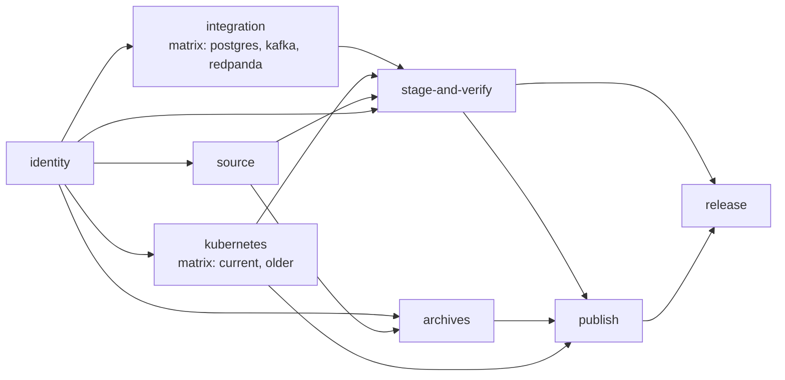
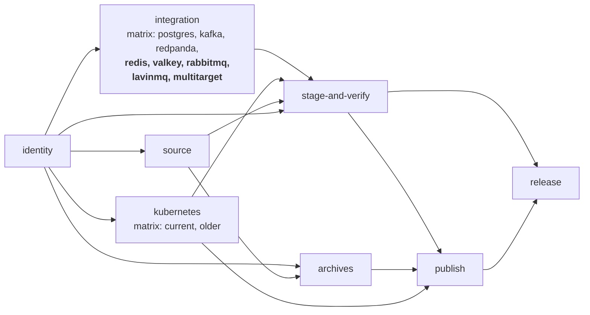

# Phase 14.0A — Hosted integration CI and release-gate contract freeze

- **Phase:** 14.0A (docs-only contract freeze; **no** production, test, CI, script or configuration
  change)
- **Baseline:** `07b4f03999d099ce16ef8729f4d0566ee1d29295`, equal to `origin/main`, clean tree,
  `make check` green before anything was edited
- **Question:** what is the smallest sustainable hosted CI and release gate that makes a real
  Redis, Valkey, RabbitMQ, LavinMQ or multi-target regression unpublishable?
- **Answer:** **MODEL B**, the shape Phase 12.2A already proved — four cheap service lanes on every
  pull request, the full five weekly, on demand, and as a **release gate**. The release change is
  **one matrix line**: `suite: [postgres, kafka, redpanda]` becomes eight entries, and the existing
  `needs:` edges already carry it
- **Outcome at the end of this phase:** one durable cross-service policy identified as ADR-worthy
  and not creatable inside this phase's file scope, so **Phase 14.0B was BLOCKED pending ADR
  resolution**
- **CORRECTED 2026-09-13 by Phase 14.0A.1.** This record originally concluded *"Phase 14.0B is
  authorized by contract"* alongside *"ADR: REQUIRED"*. **Those two cannot both be true** under the
  contract that governed this phase, which said an unresolved ADR blocks 14.0B. The technical
  contract below is unchanged and was accepted; only the authorization state was wrong, and §22 and
  §33 now record the corrected sequence. **ADR 0098 resolves it**, and 14.0B is authorized by that
  record rather than by this one
- **Blockers at the end of this phase:** one — the ADR. **Closed by Phase 14.0A.1**

---

## 1. Baseline

```
HEAD        07b4f03999d099ce16ef8729f4d0566ee1d29295  docs(roadmap): freeze post-13.1 investment direction
origin/main 07b4f03999d099ce16ef8729f4d0566ee1d29295
tree        clean
make check  GREEN
```

## 2. Methodology

Workflow facts are read from `.github/workflows/**`; target behaviour from the `Makefile`; product
versions from the compose files; conventions from `PHASE122A…md` and ADR 0095.

**Runtimes are measured, not estimated** — §9 records what was measured, on what architecture, and
which two could not be measured and why. No number in this document is invented.

## 3. Current workflow inventory

| Workflow | Trigger | What it runs |
|---|---|---|
| `ci.yml` | `pull_request`, `push: main` | `make fmt-check test vet lint build` |
| `kubernetes.yml` | `pull_request`, `push: main`, weekly `17 4 * * 1`, dispatch | `make integration-kubernetes`, CURRENT lane on PR, both lanes otherwise |
| `validate-integration.yml` | dispatch, `push: validate-integration/**` | suites `[all, postgres, kafka, redpanda]` |
| `release-oci.yml` | `push: v*` tags | identity, source, **integration**, **kubernetes**, archives, stage-and-verify, publish, release |
| `validate-oci.yml` | dispatch | staging rehearsal |
| `oci-stage-verify.yml` | `workflow_call` | reproducibility, stage, verify, smoke amd64/arm64 |

**`ci.yml` runs no integration suite at all.** `make test` is `go test ./...` with no
`-tags integration`, and every suite is behind `//go:build integration`; `go test ./test/integration/...`
matches no packages. Kubernetes is the only service with a pull-request lane.

## 4. Current release DAG



Exact edges, from `release-oci.yml`:

```
stage-and-verify  needs: [identity, source, integration, kubernetes]
publish           needs: [identity, stage-and-verify, archives, kubernetes]
release           needs: [identity, stage-and-verify, publish, archives]
```

## 5. The uncovered suites

Nine `integration-*` targets exist. **Five appear zero times across all six workflow files:**
`redis`, `valkey`, `rabbitmq`, `lavinmq`, `multitarget`. A release therefore publishes while any of
them is broken, and `docs/COMPATIBILITY.md` grades four of those platforms **Level 3 — SUPPORTED
BASIC**, whose bar includes *"a repeatable committed test"*.

## 6. Per-suite integration behaviour, from the `Makefile`

Every target is `<svc>-up` → `<svc>-test` → `<svc>-down`, orchestrated by `docker compose`, with a
**deterministic readiness loop** (not a sleep, not a retry) and `down -v --remove-orphans` cleanup.

| Suite | Compose services | Readiness probe | Readiness budget | Go test timeout | Extra setup |
|---|---:|---|---|---|---|
| **redis** | 8 | `redis-cli ping` on 7 containers incl. TLS with CA | 60 × 1 s | 15 m | `gen-certs.sh` |
| **valkey** | 6 | `valkey-cli ping` on 5 containers incl. TLS | 60 × 1 s | 15 m | `gen-certs.sh` |
| **rabbitmq** | 5 | `rabbitmq-diagnostics -q ping` on 5 brokers, **then `rabbitmq-users`** | 90 × 2 s | 20 m | `gen-certs.sh`, pre-emptive `down -v` |
| **lavinmq** | 1 | management API `GET /api/overview` | 60 × 1 s | 15 m | `gen-certs.sh`, pre-emptive `down -v`, `lavinmq-users` |
| **multitarget** | postgres + kafka + redis + rabbitmq | inherits all four | inherited | 15 m | inherits all four |

Two details that matter for hosted CI and are preserved, not redesigned:

- **RabbitMQ runs `rabbitmq-users` only after `ping` succeeds**, because Phase 9.1C measured that
  `rabbitmq-diagnostics ping` answers before `rabbitmqctl` works — the defect that once left the
  `app` principal absent while the gate looked configured.
- **RabbitMQ and LavinMQ `down -v` before `up`**, because a stale anonymous volume carries an
  `.erlang.cookie` the new container cannot read. That is what makes them reproducible on a machine
  that has run them before, and it is free on a fresh runner.

## 7. Product, version and image inventory — frozen

Taken from the compose files. **No product is upgraded by this phase.**

| Suite | Product | Version | Image reference | Compatibility row |
|---|---|---|---|---|
| redis | Redis | 8.2.1 | `redis:8.2.1-alpine` | Level 3 — SUPPORTED BASIC |
| valkey | Valkey | 8.1.1 | `valkey/valkey:8.1.1-alpine` | Level 3 — SUPPORTED BASIC |
| rabbitmq | RabbitMQ | **3.13.7, 4.0.9, 4.2.0** (three brokers, one lane) | `rabbitmq:3.13.7`, `rabbitmq:4.0.9`, `rabbitmq:4.2.0` | Level 3 — SUPPORTED BASIC |
| lavinmq | LavinMQ | 2.3.0 | `cloudamqp/lavinmq:2.3.0` | Level 3 — SUPPORTED BASIC |
| multitarget | — | inherits postgres 18, kafka 4.0.0, redis 8.2.1, rabbitmq | — | **not a compatibility claim** |

**Digest policy — ADMIT, with the derivation deferred to 14.0B.** ADR 0095 pins Kubernetes node
images as `tag@sha256:…`, and the same reasoning applies: a tag is mutable, and a graded row that
silently changes what it was graded against is not repeatable. This phase **does not invent digest
values**; 14.0B resolves each of the six image references against its authoritative registry and
records the digest in the same change that pins it.

**One pre-existing drift is recorded, not fixed here:** `postgres:18` is a floating minor tag on an
already-release-gated suite. Pinning it is outside 14.0A's scope and is noted for a future change.

## 8. Architecture evidence

| Suite | arm64 local | amd64 hosted | What 14.0B adds |
|---|---|---|---|
| Redis | **YES** — measured here | none | **first amd64 evidence** |
| Valkey | **YES** | none | **first amd64 evidence** |
| RabbitMQ | **YES** | none | **first amd64 evidence** |
| LavinMQ | **YES** | none | **first amd64 evidence** |
| Multi-target | partial (§9) | none | **first amd64 evidence** |

The local host is Darwin/arm64 running Docker 29.4.0 linux/arm64 under OrbStack. GitHub-hosted
Linux runners are **amd64**, so every lane 14.0B adds is new architecture evidence.

**This does not make svcdoctor cross-architecture-validated.** It makes each of these four products
validated on two architectures for the BASIC journey, and `docs/COMPATIBILITY.md` may say exactly
that and no more. 14.0B must not upgrade any row on the strength of a green lane — ADR 0095 §13:
*a green lane authorizes nothing*.

## 9. Measured runtimes

Measured on this machine (Darwin/arm64, OrbStack, **images already cached**), `/usr/bin/time -p`
over the full `integration-<suite>` target including `up`, `test` and `down`:

| Suite | Measured wall clock |
|---|---:|
| **valkey** | **14 s** |
| **lavinmq** | **17 s** |
| **redis** | **19 s** |
| **rabbitmq** | **117 s** |
| kafka *(already gated; for scale)* | **290 s** |
| postgres | **not measured** |
| multitarget | **not measured** |

**Two could not be measured, and the reason is recorded rather than worked around.** An unrelated
container on this machine holds host port `55434`, which `test/integration/postgres/env/compose.yaml`
binds; `postgres-up` fails with *"Bind for 0.0.0.0:55434 failed: port is already allocated"*, and
`multitarget-up` depends on `postgres-up`. **This is a local environment collision, not a repository
defect** — the fixtures use fixed host ports, which is correct and reproducible on a clean runner and
collides on a shared developer machine. It is evidence *for* hosted CI, not against it.

**Derived estimate for multi-target, labelled as such:** `multitarget-up` is
`postgres-up + kafka-up + redis-up + rabbitmq-up`, so it is dominated by Kafka's 290 s; with its own
suite and teardown, **≈ 6–8 minutes local, warm**. 14.0B measures it for real.

**Cold-pull cost is not included in any number above.** A hosted runner pulls every image on the
first run of a job. Timeouts in §16 carry the margin for it.

### 9.1 A defect the measurement found, recorded for 14.0B

Running `make integration-rabbitmq` **modifies a committed file**:

```
 M test/integration/rabbitmq/env/__pycache__/groundtruth.cpython-314.pyc
```

`__pycache__` bytecode is tracked in this repository, and a RabbitMQ fixture run rewrites it — same
length, different bytes, because the cache header carries source metadata. The file was restored to
its exact committed bytes here (verified by SHA-256; `git show HEAD:<path> > <path>`, a read-only
read, with no history command used).

**Why it matters to this phase specifically.** It is harmless locally and would be harmless on a
throwaway runner, but it means the RabbitMQ suite is **not tree-neutral**, which breaks two things a
gate wants: a `git diff --check`-style cleanliness assertion after a lane, and any future
reproducibility check that compares the tree before and after validation. It would also make the
suite unusable in a job that asserts a clean checkout.

**Not fixed here** — 14.0A changes no non-documentation file.

**FROZEN AS A PREREQUISITE by Phase 14.0A.1:**

> **RabbitMQ hosted gating is not complete until `make integration-rabbitmq` is tree-neutral.**
> Clean tree before the suite, clean tree after it, with **no Git restoration required**.

Phase 14.0B **may not** add RabbitMQ as a hosted or release gate while accepting a suite that
mutates tracked repository bytes as normal behaviour. §27 admits the narrow file surface the fix
needs and §30 makes the before/after check mandatory.

**The fix is not prescribed here**, because 14.0A inspected the symptom rather than the cause. The
likely shapes — stop tracking generated bytecode, prevent its generation in the fixture, add ignore
protection — are candidates, not instructions. What is frozen is the invariant, not the remedy.

## 10. Trigger model — MODEL B, chosen on the measurement

Three models were weighed. The hard invariant in all three: **all five gate the release.**

| Model | PR/main | Verdict |
|---|---|---|
| **A** — all five on PR | everything, every push | **REFUSE.** Puts the heaviest and highest-flake lane (four fixture sets started together) in front of every unrelated review, and §26 forbids the retry that would paper over it |
| **B** — cheap four on PR, all five weekly + dispatch + release | redis, valkey, rabbitmq, lavinmq | **ADMIT** |
| **C** — PR smoke subset, weekly full | a partial suite | **REFUSE.** Phase 12.2A already refused test tiering on measurement; a lane that asserts less than the local suite converts an absence of evidence into an appearance of it |

**Why B, on the numbers.** The four service lanes measure **14 s, 17 s, 19 s and 117 s**. Run as
parallel matrix legs their wall clock is the slowest — under two minutes warm, a few minutes cold —
against a Kubernetes lane that already holds a 40-minute budget on every pull request. They are
affordable on PR by a wide margin.

**Multi-target is `main` + `schedule` + `dispatch` + `release`, not `pull_request`.** It is the
heaviest lane by roughly an order of magnitude, it starts four fixture sets at once (the largest
flake surface in the repository), and its *unique* content — the scheduler, the `RunReport`
envelope, deterministic ordering — is the part most thoroughly covered hermetically inside
`make check` by `internal/fleet/run/{execute,isolation,stress}_test.go` and `test/fleet/`. The four
service lanes on PR already cover the per-service halves it composes.

**The cost of that choice, stated exactly.** A regression that breaks *mixed-service composition
only* — the scheduler, the aggregate, cross-service redaction — can pass review and reach `main`.
It is caught **at the merge commit** by the `push: main` run, not a week later, so the exposure
window is one merge rather than one week. It cannot reach a release.

**Recorded promotion condition:** after four consecutive weeks of green hosted `main` and scheduled
multi-target runs, promoting it to `pull_request` is a one-line change. Promotion is cheap;
demotion after it has annoyed every contributor is not, which is why the conservative direction is
chosen first.

## 11. PR/main expansion for the already-gated suites — DEFERRED

Kafka, Redpanda and PostgreSQL are release-gated with no PR or main lane (Phase 13.2 §7).

| Suite | Decision | Reason |
|---|---|---|
| Kafka PR/main | **DEFERRED** | measured at **290 s**, the heaviest single service lane; adding it is a separate cost decision |
| Redpanda PR/main | **DEFERRED** | same lane family, same cost question |
| PostgreSQL PR/main | **DEFERRED** | cheapest of the three and the most tempting, but it is not this phase's gap |

Phase 13.2 selected *the five uncovered suites*. Widening 14.0 into a full CI redesign would make it
a different phase with a different risk profile. **All three keep the protection they already have.**

## 12. Workflow shape

**One new workflow, `.github/workflows/integration.yml`, with a matrix over suites; plus one matrix
line changed in `release-oci.yml`.**

| Alternative | Verdict |
|---|---|
| One workflow per suite (five files) | **REFUSE** — five near-identical files drift; the only difference is a suite name |
| Fold into `ci.yml` | **REFUSE** — `ci.yml` is the fast quality gate; a container lane inside it makes every lint failure wait on Docker |
| **One `integration.yml` with a suite matrix + release matrix line** | **ADMIT** — mirrors `kubernetes.yml` exactly, gives one stable check name per suite, isolates failures per leg, and parallelises for free |

**Matrix is event-dependent**, exactly as `kubernetes.yml` does it:

```
pull_request           → [redis, valkey, rabbitmq, lavinmq]
push: main             → [redis, valkey, rabbitmq, lavinmq, multitarget]
schedule, dispatch     → [redis, valkey, rabbitmq, lavinmq, multitarget]
release (release-oci)  → the existing `integration` job's matrix grows to eight
```

`fail-fast: false`, so one broken product does not hide the state of the other four.

## 13. Stable check names — frozen

Required checks may depend on these strings, so they are frozen here.

| Lane | Check name |
|---|---|
| `integration.yml` legs | **`Integration (redis)`**, `Integration (valkey)`, `Integration (rabbitmq)`, `Integration (lavinmq)`, `Integration (multitarget)` |
| release legs | **`Integration (redis)`** … unchanged pattern, from the existing `name: Integration (${{ matrix.suite }})` |

This is the repository's existing convention verbatim — `release-oci.yml` already declares
`name: Integration (${{ matrix.suite }})`. **No branch-protection change is authorized by this
phase**; configuring required checks is a user-owned repository setting.

## 14. Runner, Go and cache

| Item | Contract |
|---|---|
| Runner | **`ubuntu-24.04`** — same generation pin as `kubernetes.yml`. Linux only: macOS bind mounts mask container ownership, which is how the v0.3.1 defect survived every local run |
| Go | **`go-version-file: go.mod`** — the repository convention; no separate Go-version policy |
| Cache | **`setup-go` default only.** No image cache, no compose cache — Phase 12.2A refused the same thing as complexity without an established saving |
| Docker | runner-provided. Unreachable ⇒ **FAIL, never SKIP** |

**The existing `release-oci.yml` integration job uses `go-version: '1.26'` rather than the file.**
That is a pre-existing inconsistency with `kubernetes.yml`; 14.0B may align it, and if it does, the
change is noted rather than silent.

## 15. Permissions, secrets, network

| Item | Contract |
|---|---|
| Permissions | **`contents: read`**, workflow-level, **no job escalation** |
| `pull_request_target` | **REFUSED** — executes the PR's own code inside a container runtime |
| Repository secrets | **0.** Needing one voids the design |
| Fixture credentials | ephemeral, workflow-local, non-sensitive, already in the committed compose files (`s3cr3t-pw`, `tls-pw`, `guest:guest`); certificates generated per run by `gen-certs.sh` |
| External network | container registry pull and Go module fetch **only**. No SaaS, no managed service, no cloud credential, no remote test infrastructure |
| Fork pull requests | run normally, read-only token, no secrets |

## 16. Timeouts

Chosen from §9's measurements plus cold-pull and readiness headroom, and required to exceed each
suite's own `go test -timeout` so that a hung test is reported by the harness rather than killed by
the runner.

| Lane | Measured | `go test` timeout | Readiness budget | **Job timeout** | Margin |
|---|---:|---|---|---:|---|
| redis | 19 s | 15 m | 60 s | **25 m** | ≈ 75× measured |
| valkey | 14 s | 15 m | 60 s | **25 m** | ≈ 100× |
| lavinmq | 17 s | 15 m | 60 s | **25 m** | ≈ 88× |
| rabbitmq | 117 s | 20 m | 180 s | **30 m** | ≈ 15× |
| multitarget | ≈ 6–8 m (derived) | 15 m | inherited | **40 m** | ≈ 5× |

The job timeout exists to **detect a hang**, not to bound a slow run; each exceeds its harness
timeout so the harness fails first with a useful message.

## 17. Retry, flakes and cleanup

| Item | Contract |
|---|---|
| Automatic test retry | **REFUSED.** A flaky test must not be hidden by retry-to-green |
| `continue-on-error` | **REFUSED** on every lane |
| Readiness loop | **NOT a retry.** It is a deterministic wait for a declared condition with a bounded budget, and it fails loudly with `compose ps` and per-service logs. That distinction is frozen |
| Cleanup | `if: always()` step invoking the canonical `make <svc>-down`, so a failed run still deletes volumes |
| Flake policy | **a hosted failure is a real failure until explained.** No auto-retry, no allow-failure, no silent skip |
| If a lane cannot reliably gate | the honest response is to **downgrade the compatibility claim**, never to weaken CI |

## 18. Path filters — NONE

**REFUSED**, for the reason Phase 12.2A gave and one measurement of its own: shared code breaks a
service without touching its directory. `internal/domain`, `internal/diagnosis`, `internal/render`,
`internal/security`, `internal/cli`, `internal/fleet` and `go.mod` all reach every suite — Phase
13.1C edited five rule packages at once and Phase 13.1B's goldens moved from a change in none of
them. A path filter that excluded any of those would be wrong, and one that included all of them
excludes nothing.

Required checks also report *pending* forever on a filtered-out path, which is its own failure mode.

## 19. Action pinning

Repository convention, measured: every third-party action is pinned by **40-character commit SHA**
with a `# vN` comment (ADR 0076 §2.6). The sole exception is `golangci-lint-action@v9`, recorded in
the backlog as UX-S16-b with the reason.

14.0B uses the digests already present in this repository:

```
actions/checkout@3d3c42e5aac5ba805825da76410c181273ba90b1 # v7
actions/setup-go@b7ad1dad31e06c5925ef5d2fc7ad053ef454303e # v7
```

**No new third-party action is authorized.** These two are all the lanes need.

## 20. Concurrency

Mirrors `kubernetes.yml` exactly:

```yaml
concurrency:
  group: integration-${{ github.event_name }}-${{ github.ref }}
  cancel-in-progress: ${{ github.event_name == 'pull_request' }}
```

Keying on `github.event_name` is what stops a pull-request push from cancelling a `main` or
scheduled run, and **release validation lives in `release-oci.yml`**, which has its own concurrency
and is untouched — so no branch activity can ever cancel release validation.

## 21. Artifacts

**REFUSED — none uploaded.** The failure diagnostics the lanes need are already in the job log:
every `*-up` target prints `compose ps` and the last 30–40 log lines of each service on a readiness
failure. That is harness-owned, already redacted by construction, and visible without a download.

Reopen condition, recorded: if a hosted failure proves undiagnosable from the log, 14.0B or later may
admit a **failure-only** artifact whose exact content, retention and redaction are frozen first. No
credential, no raw report, no container state.

## 22. Compatibility-claim coupling — the one ADR question

The candidate durable rule:

> A Level-3 / SUPPORTED BASIC compatibility claim must be backed by a repeatable real-product
> integration lane that gates releases.

**Decision: NOT ADMITTED as a general policy in this phase, and recorded as ADR-worthy.**

It is the right rule and it is genuinely new. ADR 0095 §2.4 establishes the *principle* for
Kubernetes — *"a version the pinned toolchain can no longer run is not repeatable and therefore no
longer Level 3"* — but it is scoped to one service and to the *can-no-longer-run* case. Generalising
it to *every* compatibility claim across every service, and binding it to the release gate, is a
durable cross-service release policy that would constrain every future adapter. That deserves an
ADR, and §48 of this phase's brief does not put `docs/decisions/` in the allowed file set.

**Correction from Phase 14.0A.1.** This section originally continued *"14.0B is not blocked by
this … the general policy can be frozen before or after 14.0B"*, and called Phase 14.0A.1 optional.
**That was wrong about this phase's own governing contract**, which said that if the Level-3 policy
requires an ADR and the ADR is unresolved, Phase 14.0B is **BLOCKED**. The reasoning behind the
original sentence — that the five lanes do not technically depend on the general policy — is sound
engineering and is **not** what the contract asked. A phase does not get to grant itself an
exception to its own gate because the gate looks avoidable in hindsight.

**The corrected sequence, stated so the history stays legible:**

| Point in time | ADR | Phase 14.0B |
|---|---|---|
| End of Phase 14.0A | **REQUIRED, unresolved** | **BLOCKED** |
| End of Phase 14.0A.1 | **ADR 0098, Accepted** | **AUTHORIZED** |

**ADR 0098 — *A Level-3 compatibility claim requires a release-gating real-product lane*** is the
resolution. It admits the rule, bounds it against the seven over-readings §22 listed, inherits
`docs/COMPATIBILITY.md`'s "no version arithmetic" semantics unchanged, and keeps trigger frequency
and multi-target explicitly outside itself. Phase 14.0B is authorized **by ADR 0098**, not by this
record.

## 23. Multi-target release policy — ADMITTED

Fleet is **not** a compatibility product claim and is deliberately not forced into the Level-3
model. Its own invariant:

> Release publication is blocked unless at least one real mixed-service `svcdoctor run --config`
> integration suite passes.

**ADMITTED, and unchanged by Phase 14.0A.1.** `svcdoctor run --config` is a released CLI surface
(Phase 9.1B) whose only end-to-end validation is `make integration-multitarget`. This needs no ADR:
it adds one entry to an existing matrix that publication already depends on, and states no new
policy about compatibility grading. **ADR 0098 §2.8 records the same exclusion from the other
side** — multi-target is a product surface, not a claim about a third-party product, and folding it
into the Level-3 model is a permanent refusal rather than a deferral.

What the suite proves, from `test/integration/multitarget/multitarget_test.go`:
`TestFourServicesThroughOneRun`, `TestARemoteRefusalDoesNotDisturbOtherTargets`,
`TestDuplicateEndpointsAreTwoExecutions`, `TestAMissingCredentialIsNotAnAuthenticationFailure`,
`TestShareableAggregateAcrossServices` — mixed service types, success and failure coexisting,
scheduler behaviour, aggregate `RunReport`, credential isolation and cross-service shareable
redaction. **All five are release-critical and none may be weakened to fit a runner.**

## 24. Proposed post-14.0B release DAG



**The new edges are: none.** The `integration` job's matrix grows from three entries to eight, and
`stage-and-verify needs: [… integration …]` already blocks on every leg because `fail-fast: false`
runs them all and the job fails if any leg fails. `publish` depends on `stage-and-verify`.

| New dependency | Kind |
|---|---|
| redis, valkey, rabbitmq, lavinmq, multitarget → `stage-and-verify` | **direct**, through the existing `integration` matrix job |
| … → `publish` | **transitive**, via `stage-and-verify` |

This was chosen over adding five new jobs precisely for auditability: **the release gate changes by
one line**, and the guard that already protects it (`TestOCIPublicationCannotStartBeforeLinuxIntegration`)
extends by five strings.

### 24.1 Failure semantics — frozen

| Event | Result |
|---|---|
| Redis / Valkey / RabbitMQ / LavinMQ / multi-target lane fails at release | **publication blocked** |
| any lane fails on PR | check **RED** |
| any lane fails on `main` | workflow **RED** |
| scheduled run fails | workflow **RED** |
| any of them | **no auto-retry, no compatibility auto-downgrade, no continue-on-error** |

## 25. Scheduled CI — ADMITTED, weekly, with an honest limitation

`cron: '37 4 * * 2'` — weekly, off the hour (scheduled runs clustering on `:00` are the ones GitHub
delays most), and on a different weekday from `kubernetes.yml`'s `17 4 * * 1` so the two heavy
container workflows do not contend.

Lanes: **all five.**

**What weekly CI does and does not detect, stated precisely.** With images digest-pinned (§7), a
scheduled run detects **runner-image drift, toolchain drift, Docker-version drift and project
regressions on `main`**. It does **not** test new upstream product releases — a new Redis or
RabbitMQ version is only ever tested by an explicit pull request that moves the pin and updates
`docs/COMPATIBILITY.md` in the same change. Any claim that weekly CI keeps svcdoctor current against
upstream would be false.

## 26. `workflow_dispatch` — ADMITTED, all five, no inputs

No free-form input. Lanes come from the frozen matrix, so a dispatched run cannot name an image or a
version and therefore cannot manufacture evidence for an ungraded product (ADR 0095 §2.3's rule,
applied unchanged).

`validate-integration.yml`'s `[all, postgres, kafka, redpanda]` choice input is **left alone** by
this phase. Whether it grows or is superseded by `integration.yml` is a 14.0B judgement, and either
way it is not a gate.

## 27. Phase 14.0B — allowed file scope

**May change:**

| File | Why |
|---|---|
| `.github/workflows/integration.yml` | new — the five lanes |
| `.github/workflows/release-oci.yml` | the matrix line, and optionally the `go-version` alignment noted in §14 |
| `internal/cli/integrationworkflow_test.go` | new — workflow contract guards (§28) |
| `internal/cli/validateworkflow_test.go` | extend `TestOCIPublicationCannotStartBeforeLinuxIntegration` with the five suites |
| `docs/validation/PHASE140B_*.md` | the record |
| `docs/BACKLOG.md` | closure |
| `docs/COMPATIBILITY.md` | **only** to describe the new gating and the added amd64 evidence. **No row may be upgraded** |

**May change — added by Phase 14.0A.1, for one purpose only:**

| File | Why |
|---|---|
| `test/integration/rabbitmq/**` | **solely** to make `make integration-rabbitmq` tree-neutral (§9.1) |
| `.gitignore`, or the nearest appropriate ignore file | same purpose — stop tracking generated bytecode |

This authorizes **nothing else**. It does not authorize changing RabbitMQ protocol semantics,
weakening or removing an integration assertion, reducing test cases, or touching production code.
**Any behavioural weakening of a test is a blocker**, not a trade for a green lane.

**May NOT change:** production Go, diagnosis, adapters, probes, wire packages, domain, renderer,
schema, fleet production code, `go.mod`, `go.sum`, the `Makefile`, any integration suite's
assertions, any compose file except to add a digest to an existing pinned tag, and any
`test/integration/**` path other than the RabbitMQ fixture hygiene named above.

**If hosted CI exposes a product bug: do not weaken the assertion.** Stop, record it, and take it to
a separate review with the options of §29.

## 28. Workflow contract tests 14.0B must add

The repository's existing model is `regexp` + `strings` over the workflow text with a `jobNeeds` /
`reaches` graph — semantic about the DAG, no YAML dependency, and `withoutComments` applied first so
prose cannot satisfy a guard. `internal/cli/kubernetesworkflow_test.go` is the template: nine named
guards plus a `…GuardsCanFail` companion.

Each of these must fail if someone:

| # | Guard |
|---|---|
| 1 | removes any of the five suites from the release matrix |
| 2 | removes any of the five from `integration.yml` |
| 3 | breaks `reaches(needs, "publish", "integration")` or the same for `stage-and-verify` |
| 4 | adds `continue-on-error` anywhere in either workflow |
| 5 | adds a `paths:` or `paths-ignore:` filter |
| 6 | escalates permissions beyond `contents: read` |
| 7 | removes or inflates a `timeout-minutes` beyond the frozen value |
| 8 | changes the runner away from `ubuntu-24.04` / any non-Linux runner |
| 9 | changes an image pin without updating the contract, or drops a digest |
| 10 | introduces `pull_request_target` |
| 11 | introduces a repository secret reference |
| 12 | adds a retry action or a re-run loop around `make integration-*` |
| 13 | replaces a canonical `make integration-<suite>` call with inline YAML |
| 14 | changes the frozen check names |

Plus a **non-vacuity companion** proving each detector fires on synthetic text that violates it —
this repository's standing requirement for any guard whose assertions are absences.

## 29. Break-it proof — what 14.0B must demonstrate

Static YAML is not evidence. 14.0B must show the lanes are load-bearing with **three controlled
failures**, one per family:

| # | Family | Break | Must be observed |
|---|---|---|---|
| 1 | Redis/Valkey | a controlled, reverted mutation in the Redis BASIC path | `make integration-redis` **fails** |
| 2 | RabbitMQ/LavinMQ | same, in the AMQP BASIC path | `make integration-rabbitmq` **fails** |
| 3 | Multi-target | same, in the fleet composition path | `make integration-multitarget` **fails** |

Each must also show that the workflow contract would surface it and that the release dependency would
block publication — provable from the `needs:` graph without pushing anything.

**Use a local controlled mutation harness with independent restoration**, the Phase 13.1C pattern: a
whole-tree SHA-256 manifest taken before the first plant and recompared after the last, derived from
the filesystem rather than from the harness's own file list. **No remote branch mutation. No
permanent production mutation. No `git stash`, `reset`, `checkout` or `restore`.**

## 30. Phase 14.0B validation contract

| Required | Note |
|---|---|
| `make check` | green |
| `make integration-redis` | green |
| `make integration-valkey` | green |
| `make integration-rabbitmq` | green |
| `make integration-lavinmq` | green |
| `make integration-multitarget` | green — **and this is the one at risk locally** (§9) |
| workflow contract tests | all, plus their non-vacuity companions |
| release DAG test | `reaches(needs, publish, integration)` with all eight suites |
| break-it proof | §29, three families, restoration independently verified |
| `git diff --check` | clean |
| no integration assertion weakened | diffed explicitly |
| **tree neutrality — FROZEN by Phase 14.0A.1** | capture the repository file-hash state **before** the five-suite validation set and compare **after**. Required: **no tracked file modified**, and no unexpected untracked generated fixture artifact. §9.1 found `make integration-rabbitmq` rewriting a committed `__pycache__` artifact, so this is a known-failing requirement until the §27 fixture-hygiene fix lands |
| **no Git restoration to pass it** | the assertion may **not** be satisfied by `git stash`, `git checkout`, `git restore` or `git reset`. The suite itself must be clean; restoring the tree to hide a mutating suite is the defect, not the fix |

**If the local environment cannot execute one of the five, 14.0B is NOT READY until equivalent
evidence exists.** Silently omitting a release-gating suite is the one outcome this phase exists to
prevent. For multi-target specifically, the recorded local blocker is a host-port collision with an
unrelated container; freeing port `55434` is enough.

## 31. Hosted-first closure rule

Phase 12.2's discipline is preserved: **local validation does not prove GitHub-hosted behaviour.**

| Status | Meaning |
|---|---|
| **IMPLEMENTATION READY FOR USER REVIEW** | 14.0B may stop here — the tree is correct, tested locally, unstaged and uncommitted |
| **HOSTED VALIDATION PASSED** | only after the user commits and pushes, and the new workflows run green on the committed revision |

**Phase 14.0 is operationally closed only at the second.** A workflow that has never run is not a
gate. The first hosted run must confirm: all five lanes execute, the four PR lanes appear on the pull
request, images pull within the timeout, `gen-certs.sh` works on `ubuntu-24.04`, RabbitMQ's
`rabbitmq-users` step succeeds after `ping`, and cleanup leaves no volume.

## 32. Compatibility failure policy

If a hosted lane proves a pinned product currently fails, choose explicitly — never silently:

1. **Fix svcdoctor** — if the defect is ours.
2. **Fix the fixture or orchestration** — if the test infrastructure is wrong, *without* weakening an
   assertion.
3. **Downgrade the compatibility claim** — if the product genuinely is no longer supported.
4. **Keep the previously validated version pinned** — the default, since pins are explicit.

**Forbidden:** weakening assertions, skipping the lane, `continue-on-error`, or claiming success.

## 33. ADR decision

| Question | Answer |
|---|---|
| Does the concrete 14.0 contract need an ADR? | **NO** — it applies ADR 0062's job graph and ADR 0095's gate precedent to five more suites |
| Does the general *"Level 3 ⇒ release-gating lane"* policy need an ADR? | **YES** — durable, cross-service, binds every future adapter |
| Is creating it authorized here? | **NO** — §48's allowed file set is the validation record and `docs/BACKLOG.md` |
| Does that block 14.0B? | ~~**NO**~~ → **YES**, corrected by Phase 14.0A.1. This phase's governing contract said an unresolved ADR blocks 14.0B, and that is the answer regardless of whether the five lanes technically depend on the policy |
| Resolved by | **ADR 0098**, Accepted, Phase 14.0A.1 |
| 14.0B state now | **AUTHORIZED — by ADR 0098**, not by this record |

**Phase 14.0A.1 was required, not optional**, and it ran. See
`docs/validation/PHASE140A1_COMPATIBILITY_RELEASE_GATE_POLICY_ADR.md`.

## 34. Stop conditions — all clear

| Condition | Status |
|---|---|
| baseline mismatch / dirty tree / pre-edit `make check` red | clear |
| integration target behaviour undeterminable | clear — all five read from the `Makefile` |
| release DAG unprovable | clear — §4 from `needs:` edges |
| product versions unestablished | clear — §7 from compose files |
| a suite not deterministic enough to gate | clear — all five use bounded readiness loops, not sleeps; four measured green here |
| hosted model requires secrets | clear — **0** |
| contract requires weakening assertions | clear — none weakened |
| compatibility claim must change first | clear — no row changes |
| ADR required and unresolved | **TRIPPED at the end of this phase.** Originally recorded as *"resolved — required only for the general policy, which is not admitted and does not block"*, which read the stop condition as though it applied only to a policy 14.0B consumed. It applies to the ADR being unresolved, full stop. **Closed by ADR 0098 in Phase 14.0A.1** |
| workflow / script / test / Go changes | clear — **0** |

## 35. Final freeze table

| # | Item | Decision | Rationale |
|---|---|---|---|
| 1 | CI architecture | **ADMIT** | MODEL B; new `integration.yml` + one matrix line in `release-oci.yml` |
| 2 | PR lanes | **ADMIT** | redis, valkey, rabbitmq, lavinmq |
| 3 | Multi-target on PR | **REFUSE** | heaviest lane, largest flake surface, strongest hermetic coverage; promotion condition in §10 |
| 4 | `push: main` lanes | **ADMIT** | all five |
| 5 | Schedule | **ADMIT** | weekly `37 4 * * 2`, all five |
| 6 | `workflow_dispatch` | **ADMIT** | all five, no inputs |
| 7 | Release gate | **ADMIT** | all five, via the existing `integration` matrix |
| 8 | New release `needs:` edges | **ADMIT — zero** | matrix growth only; maximally auditable |
| 9 | Test tiering | **REFUSE** | whole suite or nothing (12.2A precedent) |
| 10 | Runner | **ADMIT** | `ubuntu-24.04`, Linux only |
| 11 | Go | **ADMIT** | `go-version-file: go.mod` |
| 12 | Cache | **ADMIT** | `setup-go` default only |
| 13 | Image pins | **ADMIT** | exact tag **+ digest**; digests derived by 14.0B |
| 14 | Product upgrades | **REFUSE** | no version moves in 14.0 |
| 15 | `postgres:18` floating tag | **DEFER** | pre-existing, out of scope, recorded |
| 16 | Permissions | **ADMIT** | `contents: read`, no escalation |
| 17 | `pull_request_target` | **REFUSE** | untrusted code with base authority |
| 18 | Repository secrets | **REFUSE** | 0 |
| 19 | Concurrency | **ADMIT** | `integration-${event}-${ref}`, cancel on PR only |
| 20 | Timeouts | **ADMIT** | 25 / 25 / 25 / 30 / 40 minutes (§16) |
| 21 | Automatic retry | **REFUSE** | masks flakes |
| 22 | `continue-on-error` | **REFUSE** | on every lane |
| 23 | Readiness loop | **ADMIT** | deterministic wait, explicitly not a retry |
| 24 | Cleanup | **ADMIT** | `if: always()` → `make <svc>-down` |
| 25 | Path filters | **REFUSE** | shared code reaches every suite |
| 26 | Artifacts | **REFUSE** | job log already carries `compose ps` + service logs |
| 27 | Check names | **ADMIT** | `Integration (<suite>)`, existing convention |
| 28 | Branch protection | **DEFER** | user-owned repository setting |
| 29 | Kafka / Redpanda / PostgreSQL PR lanes | **DEFER** | not this phase's gap |
| 30 | `validate-integration.yml` | **DEFER** | not a gate; 14.0B may leave it untouched |
| 31 | Compatibility auto-promotion | **REFUSE** | a green lane authorizes nothing (ADR 0095 §13) |
| 32 | Multi-target release invariant | **ADMIT** | §23; no ADR needed |
| 33 | General Level-3 ⇒ gate policy | **NOT ADMITTED HERE → ADMITTED by ADR 0098** | ADR-worthy and **blocking**; resolved in Phase 14.0A.1 |
| 34 | Break-it proof | **ADMIT** | three families, local harness, independent restoration |
| 35 | Hosted closure | **ADMIT** | 14.0 closes only after a green hosted run |
| 36 | 14.0B production changes | **REFUSE** | — |
| 37 | 14.0B `Makefile` / suite-assertion changes | **REFUSE** | — |
| 38 | ADR in 14.0A | **REFUSE** | none created — file scope; created in 14.0A.1 as **ADR 0098** |
| 40 | 14.0B RabbitMQ fixture-hygiene surface | **ADMIT (14.0A.1)** | `test/integration/rabbitmq/**` and an ignore file, **solely** for tree neutrality; no assertion may weaken |
| 41 | Tree-neutrality before/after check | **ADMIT (14.0A.1)** | frozen in §30; no `git stash`/`checkout`/`restore`/`reset` may satisfy it |
| 39 | Tracked `__pycache__` rewritten by the RabbitMQ suite | **DEFER to 14.0B — now a frozen prerequisite** | §9.1. **RabbitMQ hosted gating is not complete until `make integration-rabbitmq` is tree-neutral** (Phase 14.0A.1). The fix touches `test/integration/**`, which row 40 now admits |

## 36. Open blockers

**None.**
