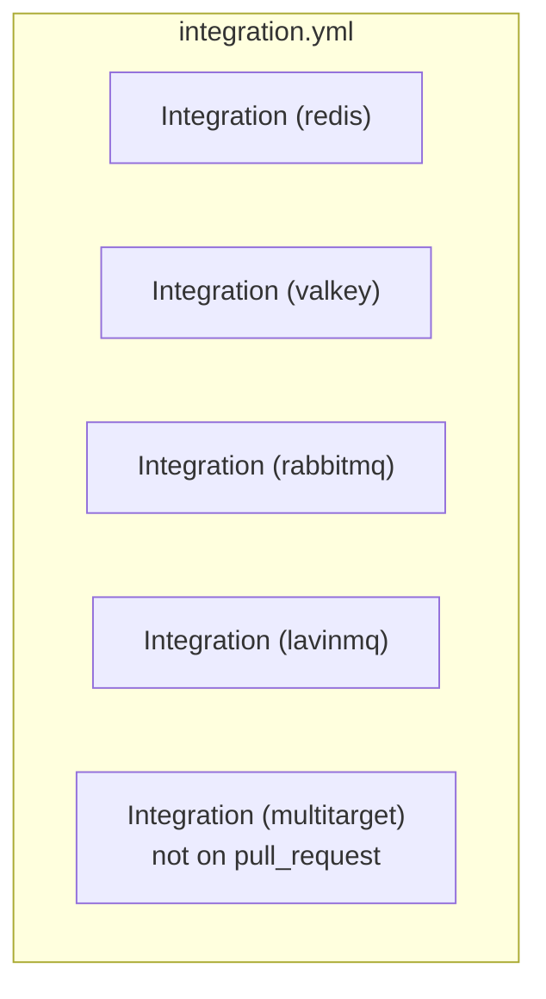

# Phase 14.0B — Hosted integration CI and release-gate implementation

- **Phase:** 14.0B (CI implementation, release-gate implementation, integration validation,
  workflow contract testing, narrow RabbitMQ fixture hygiene)
- **Baseline:** `1f20f52755dd1ced3292c667ad72bea5a6e3543e`, equal to `origin/main`, clean tree,
  `make check` green before anything was edited
- **Question:** are the five uncovered integration suites now load-bearing gates, and can that be
  proved rather than asserted?
- **Answer:** **yes for the gate, yes for four of the five suites locally, and no for multi-target
  locally** — two unrelated developer containers hold two of the three host ports its PostgreSQL
  fixture binds (`55433` and `55434`, §21), so its lane is implemented, guarded and mutation-proved
  but **NOT RUN** on this machine
- **Production Go changed:** **0**. Finding codes, rules, failure classes, schema, CLI and renderer:
  **0**
- **Blockers:** none for the implementation. **One environmental limitation is recorded rather than
  worked around** (§21), and hosted validation remains required (§28)

---

## 1. Baseline

```
HEAD        1f20f52755dd1ced3292c667ad72bea5a6e3543e  docs(ci): freeze integration release-gate policy
origin/main 1f20f52755dd1ced3292c667ad72bea5a6e3543e
tree        clean
make check  GREEN (exit 0)
```

All four gate conditions held before the first edit.

## 2. Frozen contract references

| Record | What it fixed |
|---|---|
| `docs/validation/PHASE140A_INTEGRATION_CI_RELEASE_GATE_CONTRACT_FREEZE.md` | MODEL B, the trigger matrix, runner, Go source, permissions, timeouts, concurrency, schedule, artifacts, path filters, retry policy, check names, image-pin policy, the break-it requirement, the allowed file scope |
| `docs/validation/PHASE140A1_COMPATIBILITY_RELEASE_GATE_POLICY_ADR.md` | the 14.0A contradiction reconciliation, the RabbitMQ tree-neutrality prerequisite, the fixture-hygiene file scope |
| **ADR 0098** | a Level-3 claim requires a release-gating real-product lane; "gates" is a property of the `needs:` graph |
| ADR 0062, ADR 0095 | the release job graph and the Kubernetes gate precedent this reuses |

**No Phase 14.0A decision was reopened.** Every value in §5, §9, §10, §13 and §14 below is taken
from that record rather than re-derived.

## 3. Implementation summary

| Change | Kind |
|---|---|
| `.github/workflows/integration.yml` — new, five lanes | WORKFLOW |
| `.github/workflows/release-oci.yml` — matrix 3 → 8, `go-version` alignment, teardown step | WORKFLOW |
| `internal/cli/integrationworkflow_test.go` — new, 10 guards + a non-vacuity companion | TEST |
| `internal/cli/validateworkflow_test.go` — the release suite list grows to eight | TEST |
| `test/integration/rabbitmq/env/probe.py` — `sys.dont_write_bytecode` | INTEGRATION |
| `test/integration/rabbitmq/env/__pycache__/…pyc` — **deleted** | GENERATED (removal) |
| `.gitignore` — `__pycache__/`, `*.pyc` | CONFIG |
| four compose files — 20 image references digest-pinned | INTEGRATION |
| `scripts/phase140b-mutations.sh` — new | MUTATION_HARNESS |
| this record, `docs/BACKLOG.md` | DOCUMENTATION |

## 4. Workflow topology



One workflow, one job, an event-dependent matrix. Phase 14.0A §12 refused one workflow per suite
(five near-identical files drift) and refused folding into `ci.yml` (a container lane would make
every lint failure wait on Docker).

The matrix is expressed as `include:` from a single-line expression, because Phase 14.0A §16 froze
**five different job timeouts** and a plain string matrix cannot carry them. Each entry is
`{"suite": …, "timeout": …}`; `timeout-minutes: ${{ matrix.timeout }}` consumes the second.

**A `matrix.include` overlay was considered and refused.** An overlay entry
`{suite: multitarget, timeout: 40}` overwrites the `suite` key of every base combination, so GitHub
cannot merge it and creates a new combination instead — which would run multi-target on pull
requests, the exact thing §18 of this phase's contract forbids. The pure-expression form has no such
failure mode.

## 5. Trigger matrix — as frozen, verified by test

| Suite | `pull_request` | `push: main` | `schedule` | `workflow_dispatch` | release gate |
|---|:--:|:--:|:--:|:--:|:--:|
| Redis | YES | YES | YES | YES | **YES** |
| Valkey | YES | YES | YES | YES | **YES** |
| RabbitMQ | YES | YES | YES | YES | **YES** |
| LavinMQ | YES | YES | YES | YES | **YES** |
| **Multi-target** | **NO** | YES | YES | YES | **YES** |

`TestTheIntegrationMatrixIsEventDependentExactlyAsFrozen` evaluates the expression for all four
events and asserts the lane set **and** each lane's timeout, in both directions: an unfrozen lane
fails as loudly as a missing one.

**Kafka, Redpanda and PostgreSQL were not promoted to PR/main.** Phase 14.0A §11 deferred all three
and this phase kept that deferral; their existing release gates are untouched. Kubernetes remains
under its own Phase 12.2 workflow model, unmodified.

## 6. Release matrix — before and after

```
before  suite: [postgres, kafka, redpanda]
after   suite: [postgres, kafka, redpanda, redis, valkey, rabbitmq, lavinmq, multitarget]
```

3 → **8**. The existing three were neither removed nor reordered.

## 7. Release DAG proof

**No dependency edge was added.** The edges read from `release-oci.yml` after the change are exactly
the edges before it:

```
stage-and-verify  needs: [identity, source, integration, kubernetes]
publish           needs: [identity, stage-and-verify, archives, kubernetes]
release           needs: [identity, stage-and-verify, publish, archives]
```

Gating therefore works by matrix growth: `fail-fast: false` runs every leg, the job fails if any leg
fails, and `stage-and-verify` already names `integration`.

| Failure | Consequence | Kind |
|---|---|---|
| Redis lane fails | `publish` unreachable | direct → `stage-and-verify`, transitive → `publish` |
| Valkey lane fails | `publish` unreachable | same |
| RabbitMQ lane fails | `publish` unreachable | same |
| LavinMQ lane fails | `publish` unreachable | same |
| Multi-target lane fails | `publish` unreachable | same |

**This is proved from `needs:`, not inferred from names.** `TestEveryGatedSuiteBlocksPublication`
parses the graph, asserts the direct `stage-and-verify → integration` edge with `containsString`,
asserts `reaches()` for `stage-and-verify`, `publish` **and** `release`, and fails first if the graph
parsed to fewer than five jobs or if any of the four named jobs is absent — so it cannot pass
vacuously. MC-09 cuts the edge and is caught.

## 8. Stable check identities

| Lane | Job name |
|---|---|
| `integration.yml` | `Integration (redis)`, `Integration (valkey)`, `Integration (rabbitmq)`, `Integration (lavinmq)`, `Integration (multitarget)` |
| `release-oci.yml` | unchanged pattern, same string |

Phase 14.0A §13 froze the job-name string, which is the repository's existing convention verbatim.
The workflow is named `Integration`, so GitHub composes `Integration / Integration (redis)`. That
composition is redundant-looking and is **deliberately not "improved"**: §13 froze the job name and
a required check may depend on it, so renaming it is a branch-protection change rather than a
cosmetic one. **No branch protection was touched** — it is a user-owned repository setting.

## 9. Runner

`ubuntu-24.04`, both lanes. No macOS, no Windows. The guard rejects `ubuntu-latest`, `macos-` and
`windows-`.

Hosted runners are amd64 and every local measurement behind this contract is arm64, so these lanes
are the **first amd64 evidence** for all five suites. That makes each product validated on two
architectures for the BASIC journey and **nothing more** — no compatibility row was upgraded.

`release-oci.yml`'s integration job keeps its pre-existing `ubuntu-latest`. Changing it was not
frozen, is not required, and is recorded as existing debt in §29.

## 10. Permissions

`permissions: contents: read` at workflow scope, no job escalation. The guard rejects
`contents: write`, `packages: write`, `id-token: write`, `actions: write`, `pull-requests: write`
and `attestations: write` anywhere in the file. Publication permissions remain isolated to
`release-oci.yml`'s publication jobs, which this phase did not touch.

## 11. Secrets

**Required repository secrets: ZERO.** The guard rejects both `secrets.` and `secrets:`, so an
inherited secret is caught as well as a named one. Fixture credentials are the committed,
non-sensitive values the compose files already carry (`s3cr3t-pw`, `tls-pw`, `guest:guest`) plus
certificates minted per run by `gen-certs.sh`. No cloud credential, no external service, no managed
database or broker.

## 12. Path filters

**None**, and the guard rejects `paths:` and `paths-ignore:` in the trigger header. Shared code
reaches every suite: `internal/domain`, `internal/diagnosis`, `internal/render`,
`internal/security`, `internal/cli`, `internal/fleet` and `go.mod`. A filter excluding any of them
would be wrong and one including all of them excludes nothing — and a filtered-out required check
reports *pending* forever rather than green.

## 13. Retry policy

**No automatic retry of a job, a step or a test. No `continue-on-error` on any lane.** The guard
rejects `nick-fields/retry`, `for attempt in`, `until make`, `retry-on`, `max_attempts`, `retries:`,
`continue-on-error` and `|| true`.

The bounded readiness loop inside each `*-up` target is **not** a retry and that distinction is
frozen: it is a deterministic wait for a declared condition with a bounded budget, it lives in the
Makefile rather than in YAML, and it fails loudly with `compose ps` and per-service logs. No
readiness check and no assertion was weakened.

## 14. Timeout policy

| Lane | `go test` timeout | Job timeout | Source |
|---|---|---:|---|
| redis | 15 m | **25** | 14.0A §16 |
| valkey | 15 m | **25** | 14.0A §16 |
| lavinmq | 15 m | **25** | 14.0A §16 |
| rabbitmq | 20 m | **30** | 14.0A §16 |
| multitarget | 15 m | **40** | 14.0A §16 |

No value was invented. Each budget exceeds its suite's own `go test -timeout` so the harness fails
first with a goroutine dump, and the guard re-reads those Go timeouts out of the Makefile — so
shortening one without re-deriving the job budget fails the build.

## 15. Product and image references

Six distinct references across four compose files, **20 image lines**, every one now pinned by tag
**and digest**. Phase 14.0A §7 admitted the policy and deferred derivation to here.

| Product | Reference | Index digest |
|---|---|---|
| Redis 8.2.1 | `redis:8.2.1-alpine` | `sha256:987c376c…1593232` |
| Valkey 8.1.1 | `valkey/valkey:8.1.1-alpine` | `sha256:6a57d58c…096a99f` |
| RabbitMQ 3.13.7 | `rabbitmq:3.13.7` | `sha256:87178a0e…aa0c1e3` |
| RabbitMQ 4.0.9 | `rabbitmq:4.0.9` | `sha256:ac54b28e…1b2654f2` |
| RabbitMQ 4.2.0 | `rabbitmq:4.2.0` | `sha256:8b31dd49…ba1c57259` |
| LavinMQ 2.3.0 | `cloudamqp/lavinmq:2.3.0` | `sha256:3dd7f348…97c14da3` |

**No digest was invented, and each was confirmed twice, independently.** Once from the Docker Hub
registry API (`Docker-Content-Digest`, requested with `Accept:` for the OCI index and Docker
manifest-list types — the returned `Content-Type` confirms every one is a multi-architecture
**index**, not a per-architecture manifest, so it resolves on hosted amd64 and on arm64 alike), and
once from Docker's own `RepoDigests` for the locally present images the graded suites actually ran
against. The two agreed on all six.

**No product version moved.** The tags are exactly the ones Phase 14.0A recorded and the suites were
re-run against them afterwards.

The pins live in the compose files — the canonical orchestration the Make targets read — and are
**not** duplicated into YAML. One source of truth.

## 16. RabbitMQ tree-neutrality fix

**Cause, established from source rather than from the symptom.** `harness_test.go:120` runs
`python3 env/probe.py` on the host; `probe.py` does `import groundtruth`; CPython writes
`env/__pycache__/groundtruth.cpython-314.pyc` next to the source. One such file was **tracked**, so
every RabbitMQ run rewrote a committed artifact — same length, different bytes, because the cache
header carries source metadata.

**Fix, three parts, narrowest first:**

1. `probe.py` sets `sys.dont_write_bytecode = True` **before** the import, which is where CPython
   consults it. Verified empirically on Python 3.14.7 — the interpreter whose name is in the stale
   artifact — by importing the real `groundtruth.py` with and without the flag: without it a
   `__pycache__` appears, with it nothing is written.
2. The stale tracked `.pyc` is deleted from the working tree (an **unstaged** deletion; the index was
   never touched).
3. `.gitignore` gains `__pycache__/` and `*.pyc` as a second line of defence for an invocation path
   or interpreter that writes one anyway.

**Nothing was weakened.** No RabbitMQ scenario was removed, no assertion changed, the Python
ground-truth validation still runs on every scenario that used it, and `env/groundtruth.py` — which
is the evidence — remains tracked. Generated cache is not test evidence. The `probe.py` diff is
additive: one statement and its rationale.

## 17. Workflow contract tests

`internal/cli/integrationworkflow_test.go`, extending the repository's established style — `regexp`
and `strings` over comment-stripped workflow text with the existing `jobNeeds`/`reaches` graph
helpers. **No YAML dependency was introduced.**

| Guard | Covers |
|---|---|
| `TestTheIntegrationWorkflowTriggersOnExactlyTheFrozenEvents` | four triggers, cron value, no `pull_request_target`, no dispatch inputs, no path filters |
| `TestTheIntegrationWorkflowHoldsNoAuthorityItDoesNotNeed` | `contents: read`, six escalations, zero secrets, no artifacts, no pipe-into-shell, the two pinned actions |
| `TestTheIntegrationLanesRunOnTheFrozenRunnerAndBudget` | runner, non-Linux refusal, matrix timeout, the five Go timeouts in the Makefile, Go from `go.mod`, check identity |
| `TestTheIntegrationMatrixIsEventDependentExactlyAsFrozen` | lane sets and timeouts for four events, multi-target excluded from PR and present on the other three, no image named |
| `TestTheIntegrationWorkflowDelegatesToTheHarness` | canonical `make` target, `if: always()` teardown, no inline fixture logic, six retry idioms, `continue-on-error`, `|| true` — **for `integration.yml` and the release job alike** |
| `TestTheIntegrationConcurrencyCancelsOnlyPullRequests` | group includes the event, cancel scoped to PR, release never cancellable |
| `TestEveryGatedSuiteBlocksPublication` | the `needs:` graph, the direct edge, all eight suites, exact count, `fail-fast: false`, Linux |
| `TestTheGatedServiceImagesArePinnedByDigest` | every image line digest-pinned in all four compose files, plus the six frozen references |
| `TestTheRabbitMQFixtureWritesNoBytecode` | the guard exists, precedes the import, and the ignore rules are present |
| `TestOCIPublicationCannotStartBeforeLinuxIntegration` | extended from three suites to eight |

**Non-vacuity — `TestTheIntegrationWorkflowGuardsCanFail`, 12 sub-tests.** Every detector whose
assertion is an *absence* is exercised against synthetic text that violates it: a leaked
multi-target PR lane, a dropped main lane, a dropped service lane, an inflated timeout, a missing
timeout, a severed release edge, a transitive-only edge mistaken for a direct one, an undigested
image, the positional job-block extractor, the matrix regex, the workflow's location under the
supply-chain glob, and the existence of a Make target for every release matrix entry.

**A defect was found while writing these.** Two non-vacuity fixtures began `"jobs:\n…"`, but
`jobNeeds` cuts at `"\njobs:\n"` — so the fixture parsed to an **empty graph** and the sub-test
asserting "`reaches()` reports no dependency" passed by having nothing to report. Both now start
with a newline and assert the parsed job count before asking about edges.

**The same defect exists, unfixed, in `internal/cli/kubernetesworkflow_test.go:733`** — its
`"a missing release edge is detected"` sub-test uses the identical fixture shape and was measured
here parsing to **0 jobs**. It is a pre-existing Kubernetes guard, outside this phase's subject, so
it is reported rather than changed; the remedy is one leading `\n`. Recorded in §29 and in
`docs/BACKLOG.md`.

## 18. Controlled break-it validation

Phase 14.0A §29 requires three families. Static YAML is not evidence.

| Family | Break | Observed |
|---|---|---|
| **A — Redis/Valkey** | `pingFrame` RESP `PING` → `PANG` in `internal/adapter/redis/wire/conn.go` | `make integration-valkey` **fails** |
| **B — RabbitMQ/LavinMQ** | AMQP `ProtocolHeader` `0x09` → `0x08` in `internal/adapter/rabbitmq/wire/frame.go` | `make integration-lavinmq` **fails** |
| **C — Multi-target** | the gate's removal and bypass | MC-05, MC-06, MC-08 all **caught** |

Families A and B are `MC-27` and `MC-28`, and each is **non-vacuous by construction**: the harness
runs the lane on the pristine tree first and reports `ALREADY RED` rather than a catch if it was not
green to begin with.

**Family C is proved through its guards rather than through its suite**, which Phase 14.0A §29
admits explicitly (*"and/or the relevant workflow contract test catches removal/bypass of the
target"*). The multi-target suite cannot run here — §21. What is proved is that the lane cannot be
dropped from main, cannot be smuggled onto pull requests, and cannot leave the release matrix, and
that cutting the release edge is caught. **That is weaker than running the suite, and it is written
as weaker rather than presented as equivalent.**

## 19. Mutation report and restoration proof

`scripts/phase140b-mutations.sh` — **28 planted, 28 caught, 0 survivors.**

| ID | Invariant tested | ID | Invariant tested |
|---|---|---|---|
| MC-01 | Redis loses its hosted lane | MC-15 | `pull_request_target` introduced |
| MC-02 | Valkey loses its hosted lane | MC-16 | a repository secret referenced |
| MC-03 | RabbitMQ loses its hosted lane | MC-17 | canonical `make` replaced by inline YAML |
| MC-04 | LavinMQ loses its hosted lane | MC-18 | an image pin loses its digest |
| MC-05 | multi-target loses main/schedule/dispatch | MC-19 | the weekly schedule changes |
| MC-06 | multi-target smuggled onto pull requests | MC-20 | unconditional teardown dropped |
| MC-07 | Redis leaves the release matrix | MC-21 | an action is unpinned |
| MC-08 | multi-target leaves the release matrix | MC-22 | the frozen check identity changes |
| MC-09 | the `integration → stage-and-verify` edge is cut | MC-23 | concurrency cancels scheduled runs |
| MC-10 | `continue-on-error` added to a required lane | MC-24 | the RabbitMQ bytecode guard reverted |
| MC-11 | permissions escalated | MC-25 | the bytecode ignore rule removed |
| MC-12 | a path filter added | MC-26 | the release matrix becomes fail-fast |
| MC-13 | the runner changes | MC-27 | **FAMILY A** — broken RESP PING vs `integration-valkey` |
| MC-14 | a lane's required timeout removed | MC-28 | **FAMILY B** — broken AMQP header vs `integration-lavinmq` |

**The first run caught 24 of 28, and not one of the four misses was a surviving guard.** All four
were reported `COULD NOT PLANT` — the harness's own anchor assertions refused to score a plant it
had not actually made, which is the behaviour the `ALREADY RED` / `NO MATCHING TEST` / undeclared-
target checks exist to produce. Three were shell/Python escaping defects around `$`, `{{` and
backslash-`r`; one (MC-07) had a post-condition that matched prose in a comment rather than the
matrix line. All four anchors were rewritten with `chr()` and exact-occurrence-count assertions.

**Restoration is proved three ways, and the last two know nothing about the harness's own file
list** — the failure mode Phase 13.1B lost a run to:

```
(1) declared write-set      7 files restored byte-for-byte
(2) every tracked file      identical (git ls-files, independent of FILES)
(3) every worktree path     identical (find, independent of FILES)
```

Checks (2) and (3) skip the gitignored `test/integration/*/env/certs/` directories, stated in the
script: that is throwaway TLS material the fixtures regenerate on certificate expiry, it is never
tracked and never restored, so hashing it would report a false mutation on rollover day. Nothing is
planted there.

**Independently re-verified after the harness exited**, outside it: every tracked file's SHA-256 was
compared against the manifest taken before the first integration run and is **identical**. The only
new worktree path is the harness script itself.

**No `git stash`, `checkout`, `restore` or `reset` was used anywhere**, in the harness or outside it.

## 20. Integration results

Darwin/arm64, Docker 29.4.0 linux/arm64 under OrbStack, images warm.

| Command | Result | Wall clock |
|---|---|---:|
| `make integration-redis` | **GREEN** | 10.2 s |
| `make integration-valkey` | **GREEN** | 5.2 s |
| `make integration-rabbitmq` | **GREEN** | 99.5 s |
| `make integration-lavinmq` | **GREEN** | 6.5 s |
| `make integration-multitarget` | **NOT RUN** — §21 | — |

All four that ran were re-run **after** the image references were digest-pinned, so these are
measurements of the pinned images.

## 21. The multi-target environmental limitation

`make integration-multitarget` exits 2 during `postgres-up`:

```
Error response from daemon: failed to set up container networking: driver failed programming
external connectivity on endpoint svcd-pg-readonly: Bind for 0.0.0.0:55434 failed: port is
already allocated
```

**CORRECTED after three closure attempts: the blocker is two ports, not one.** The PostgreSQL
fixture binds **three** host ports — `55432`, `55433` and `55434` — and **two** of them are held by
two different unrelated developer containers:

| Fixture container | Host port | Held by | Image |
|---|---:|---|---|
| `svcd-pg` | 55432 | — free | — |
| `svcd-pg-plaintext` | **55433** | `apsis_local` | `postgres:16-alpine` |
| `svcd-pg-readonly` | **55434** | `apsis_fresh` | `postgres:16-alpine` |

Phase 14.0A §9 and this record's own first draft both named only `55434`, because that is whichever
container `docker compose` happened to start first; `55433` was masked behind it. Two of the three
closure attempts failed on `55434` and one failed on `55433`, which is the same collision reported
in a nondeterministic order rather than two different problems.

**So "freeing port 55434 is enough" was wrong, and it is corrected here rather than left to send the
next reader round the same loop.** Both `55433` and `55434` must be free. Measured state at the last
attempt: `apsis_fresh` `RestartPolicy=no`, `StartedAt=2026-09-13T16:15:02Z`, unchanged across all
three attempts — neither container was ever stopped, and nothing restarted them.

This remains a local environment collision, not a repository defect: the fixtures use fixed host
ports, which is correct and reproducible on a clean runner and collides on a shared developer
machine.

**Nothing was fabricated and no unrelated container was stopped.** The phase contract forbids
touching user containers; authorization to stop and restart them was requested twice and not given,
so both suites are reported NOT RUN. The svcdoctor fixtures that `postgres-up` had already created
were torn down with `make postgres-down` / `make multitarget-down` after every attempt; `docker ps -a`
shows no `svcd-*` container remaining and all three user containers are untouched.

**What this does and does not leave unproven.** The multi-target *gate* is implemented, guarded and
mutation-proved (MC-05, MC-06, MC-08). What is unproved locally is that the *suite* passes on this
commit. Phase 14.0A §30 is explicit that this makes 14.0B not fully closed until equivalent evidence
exists, and the hosted `push: main` run is that evidence. **Freeing both `55433` and `55434` and
re-running the two commands is enough to close it locally.**

## 22. Existing release-service regression

`release-oci.yml` was modified, so its other legs were re-validated rather than assumed.

| Command | Result | Wall clock |
|---|---|---:|
| `make integration-kafka` | **GREEN** | 276 s |
| `make integration-redpanda` | **GREEN** | 20.6 s |
| `make integration-postgres` | **NOT RUN** — blocked by the same two-port collision as §21 (`55433` and `55434`); attempted three times, exits 2 at `postgres-up` in ~1.3 s without starting the suite |

Matrix-to-target mapping is proved for **all eight** regardless: the non-vacuity companion
`"every frozen release suite has a Make target"` asserts that both `integration-<suite>` and
`<suite>-down` exist in the Makefile for every entry, so a matrix naming a target that does not
exist fails at `make check` rather than on a release tag.

## 23. Tree-neutrality proof

**Before method.** Three manifests captured before the first integration run: SHA-256 of every
tracked file (`git ls-files`), `git status --porcelain -uall`, and a `find` enumeration of every path
in the worktree. All derived from git and the filesystem, not from any hand-maintained list.

**After method.** The same three, recomputed and diffed.

| Checkpoint | Tracked-file hashes | Worktree paths | `__pycache__`/`*.pyc` |
|---|---|---|---|
| after `make integration-rabbitmq` | **IDENTICAL** | **IDENTICAL** | none |
| after the full four-suite set | IDENTICAL | IDENTICAL | none |
| after the mutation harness | **IDENTICAL** | +`scripts/phase140b-mutations.sh` only | none |
| after kafka and redpanda | **IDENTICAL** | unchanged | none |

**The RabbitMQ row is the frozen prerequisite and it passes.** Not one tracked byte changed, and not
even an *ignored* file appeared — the fix prevents the write rather than hiding it. `git diff --check`
is clean.

**No Git restoration was used to reach any of this.** The comparison is against an intended
write-set, not against an empty `git status`, because the implementation tree is dirty by design.

## 24. `make check`

**GREEN (exit 0)** before the first edit, and **GREEN (exit 0)** at final state, including
`gofmt -l` clean, `go vet`, `golangci-lint run ./...` at **0 issues**, and `CGO_ENABLED=0 go build`.

## 25. Race and fuzz decisions

**Race: run, narrowly.** `go test -race -count=1 ./internal/cli/` — **PASS**. That is the one package
with Go changes. A repository-wide race campaign would re-measure code that did not move; production
Go is unchanged.

**Fuzz: omitted, deliberately.** This phase modifies no parser, no protocol decoder, no serializer,
no security boundary and no domain constructor. The only Python change disables a bytecode cache.
There is no new input surface to fuzz.

## 26. Dependency changes

| Kind | Change |
|---|---|
| Go modules | **0** — `go.mod` and `go.sum` untouched |
| GitHub Actions | **0 new**. `actions/checkout@3d3c42e5…` and `actions/setup-go@b7ad1dad…`, the SHAs this repository already carries |
| Container images | **0 product changes.** Six references gained a digest suffix; no tag moved. §15 lists every one |
| Scripts / tools | one new repository script, no new external tool |

## 27. Public behaviour invariants

| Surface | Change |
|---|---|
| FindingCodes | **NO** (69) |
| Rules | **NO** (24) |
| Failure classes | **NO** (42) |
| Diagnosis | **NO** |
| CLI flags / commands | **NO** |
| JSON schema / `SchemaVersion` | **NO** (1) |
| `RunReport` schema / `RunSchemaVersion` | **NO** (1) |
| Terminal renderer | **NO** — 0 renderer files changed |
| Exit semantics | **NO** (5 exit codes) |
| Security model | **NO** — `Reveal` 5, `SecretFor` 5 |
| Recommendation actions | **NO** |
| **Compatibility claims** | **NO** — no row upgraded, added or downgraded |
| Supported product versions | **NO** |

The only behaviour this phase changes is **CI and release validation**. Workflow behaviour is not
product runtime behaviour.

`docs/COMPATIBILITY.md` was **not modified**. A green lane authorizes nothing (ADR 0095 §2.3), the
rows' text is unchanged, and `internal/cli/docsclaims_test.go` continues to pass.

## 28. Hosted-validation boundary

**Local validation does not prove GitHub-hosted behaviour.** Phase 14.0 is operationally closed only
after the user commits and pushes and the workflows run green on the committed revision.

Two properties are **statements about GitHub's runtime** and cannot be asserted from this tree:

1. That `include: ${{ … fromJSON(…) }}` expands into one job per object. A failure here makes the
   job fail to start — loud, never a false green.
2. That the job `name` renders the check as `Integration / Integration (redis)`.

The first hosted run must confirm: all five lanes execute, the four PR lanes appear on the pull
request, images pull within the timeout, `gen-certs.sh` works on `ubuntu-24.04`, RabbitMQ's
`rabbitmq-users` step succeeds after `ping`, multi-target passes on `main`, and cleanup leaves no
volume.

**If a hosted lane fails, it is a real failure until classified** — workflow defect, runner issue,
fixture determinism, svcdoctor regression, or product/image issue. No assertion weakening, no
`continue-on-error`, no retry-to-green. ADR 0098 §2.5 names the four permitted responses.

## 29. Known remaining debt

| Item | State |
|---|---|
| **Multi-target and PostgreSQL not run locally** | host ports **55433 and 55434** held by two unrelated containers, `apsis_local` and `apsis_fresh` (§21). Closes by freeing **both**, or by the hosted run |
| `kubernetesworkflow_test.go:733` non-vacuity sub-test is vacuous | measured here at 0 parsed jobs; pre-existing, out of scope, one leading `\n` to fix (§17) |
| `postgres:18` floating minor tag | pre-existing, Phase 14.0A §7 and freeze row 15 deferred it; **not** opportunistically redesigned here |
| `release-oci.yml` `source` job pins `go-version: '1.26'` | pre-existing second toolchain authority; only the `integration` job was aligned, which 14.0A §14 named |
| `release-oci.yml` integration job on `ubuntu-latest`, no `timeout-minutes` | pre-existing shape, not frozen by 14.0A, deliberately untouched |
| `validate-integration.yml`'s `[all, postgres, kafka, redpanda]` input | 14.0A §26 and freeze row 30 left it alone; it is not a gate |
| Branch protection / required checks | user-owned repository setting; **not touched**, 14.0A freeze row 28 |
| Kafka / Redpanda / PostgreSQL PR lanes | deferred by 14.0A §11, unchanged |

## 30. Final implementation block

| Item | Result |
|---|---|
| Baseline gate | PASS |
| Frozen contract contradictions found | **none** |
| Production Go changes | **0** |
| Workflow contract tests | **GREEN**, with a 12-case non-vacuity companion |
| Release DAG | **VERIFIED from `needs:`** |
| Mutation closure | **28 / 28 / 0 survivors** |
| Restoration | **VERIFIED three ways, independently of the harness** |
| RabbitMQ tree neutrality | **PASS** |
| `make check` | **GREEN** |
| `git diff --check` | **CLEAN** |
| Integration suites run | **6 GREEN** (redis, valkey, rabbitmq, lavinmq, kafka, redpanda) |
| Integration suites not run | **2** (multitarget, postgres) — one environmental cause, recorded |
| Compatibility rows changed | **0** |
| Hosted validation | **REQUIRED, not yet executed** |

**No commit, push, tag, merge, rebase, reset, cherry-pick, revert or stash was executed.** `HEAD` and
`origin/main` are unchanged at the baseline commit and every change is unstaged.
